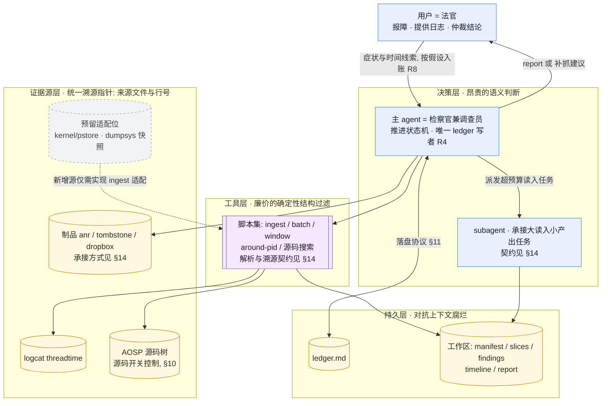
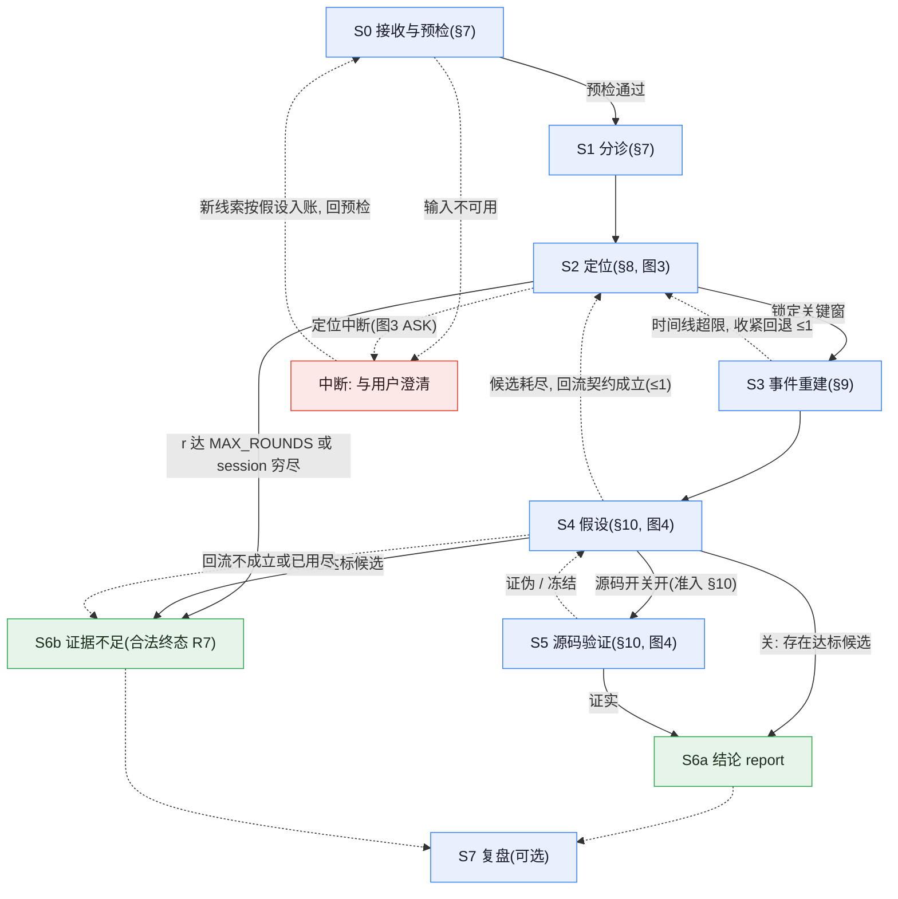
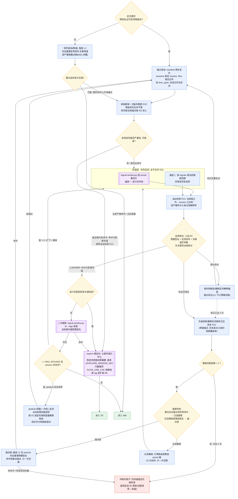
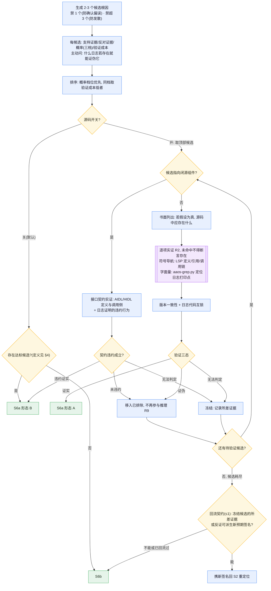
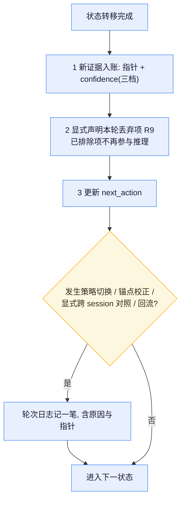
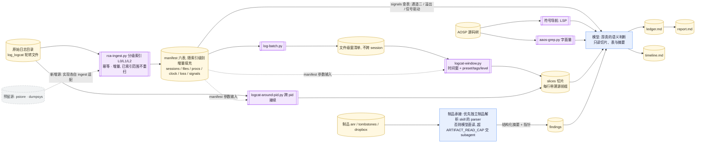

# zwdroid-android-bug-analysis · 工作流规格书(需求 · 流程设计 · 技术实现)

> Android/AAOS bug 根因分析(RCA)工作流的三层合一规格:
> **需求**(§1-§2)· **流程设计**(§3-§13)· **实现**(§14-§16)。
> 本文自成体系:行为规则、量与计数器、红线、预算在文中完整定义;
> 仅执行细则与工具实现外置为 §16 的**外部引用件**(逐件标明作用与设计说明)。
> 接口细节以引用件为准,设计意图与流程规则以本文为准。
> 正文只写最终设计;尚未落地的设计点集中登记在 §15,不在正文标注。
>
> **图例**:圆角矩形 = 模型执行 · 菱形 = 模型决策 · 双边框 = 脚本 · 圆柱 = 文件/证据源 ·
> 绿色 = 合法终态 · 红色 = 中断问用户 · 灰色虚线框 = 预留位 · `Rn` = 红线编号(§12)。

---

# 第一部分 · 需求

## 1 · 问题与目标

**场景**:车机(AAOS)或手机连续抓取的 logcat 日志,单文件约 10 万行、20MB 轮转,
一次问题现场常跨几十个文件、多次开机;用户报一个症状和一个大概时间
("切完用户音乐窗口自己弹出来了,大概两点零几分"),要求定位根因。

**三个决定架构的现实约束**:

1. **数据量超 agent 上下文两个数量级**。逐行读日志在经济上不成立,注意力必须花在刀刃上。
2. **日志的不可信之处是系统性的**:重启后 pid 与时间戳语义全部重置;开机校时造成时钟跳变;
   logd 限流(chatty)成段丢行;`-b all` 合并流相邻行毫秒级乱序。不为这些建模的分析流程,
   结论可能建立在幻觉之上。
3. **分析跨会话**。上下文会被压缩、会话会中断,流程必须假设"随时断、随处续"。

**交付**:一条从症状回溯到责任组件/代码位置的**证据链**——每一节可回溯到
`来源文件:行号`——或一份诚实的"证据不足 + 补抓建议"。结论分两级:

- **形态 B**(默认,日志级):责任组件 + 触发条件 + 违约行为;
- **形态 A**(源码开关开,准入见 §10):在 B 之上落到源码 `path:line` 与修复方向。

**验收标准**(实现完成的定义):

1. **端到端**:对合成日志样例,S0→S6 全程跑通,session 切分与 manifest 表数正确;
2. **证据链**:report 每一节带 `文件:行号` 指针,红线 R1-R15 零违例;
3. **可恢复性**:任一状态中断后,新会话仅凭 ledger + manifest 续跑,不重做已入账事实,
   不复活已排除候选;
4. **合法终态**:证据不足的案例产出合规 S6b(§6 产出清单),而非硬凑结论。

## 2 · 非目标与能力边界

- **kernel panic / pstore 深解析**:硬重启(panic、硬件 watchdog、掉电)的证据在
  `console-ramoops`/pstore 里,根本不在 logcat 里——纯 logcat 对重启类只能覆盖
  Java watchdog 级软重启。此边界以证据源适配位(§5)诚实占位;适配器落地前,
  硬重启类 bug 的合法产出是 S6b + "补抓 console-ramoops"建议。
- **perfetto 级帧归因**:logcat 对卡顿只能给出粗信号与疑似进程;帧级归因
  (主线程/RenderThread/SurfaceFlinger/GPU)需要 trace,超出文本日志的信息含量上限。
- **日志抓取、解压、分包**:上游步骤,不属于分析流程。
- **多设备/多源时间对齐**(如 MCU、CAN 总线日志):当前单设备假设。

边界的共同原则:**工具的信息含量上限决定承诺上限**——宁可把"做不到"写清楚,
不让流程在证据不存在的地方空转。

---

# 第二部分 · 设计基座

## 3 · 设计公理(五条骨干)

以下五条经真实案例端到端验证,是本设计不动摇的地基。公理只回答"为什么";
可执行的"不许什么"一律下沉红线(§12),"怎么做"由各流程章节承载。

| # | 公理 | 视角 | 一句话依据 |
|---|------|------|-----------|
| A1 | **分工经济学**:脚本做廉价、确定性的结构过滤;模型只花在昂贵的语义判断 | Agent | 10 万行/文件的体量下,注意力管理就是流程本身 |
| A2 | **证据链先于结论**(执行规则:R1/R7) | 架构 | 可信性是这个工具唯一的立身之本,硬凑的结论比没有结论更贵 |
| A3 | **落盘先于记忆**(执行规则:R4,§11) | Agent | 上下文压缩不是异常,是常态;推理状态必须外置 |
| A4 | **日志的不可信之处是一等公民**(执行规则:R12/R13) | Android | "日志里没有 X"在 chatty 丢行面前一文不值 |
| A5 | **结构性防偏误**(执行规则:R8/R9/R10/R14 与候选纪律 §10) | 架构+Agent | 确认偏误不能靠自觉克服,只能靠流程结构消解 |

## 4 · 术语、量与计数器

本节是全文所有术语和计数器的**唯一定义处**,其余章节只引用不重述。

### 术语

| 术语 | 定义 |
|------|------|
| 报时锚(粗锚) | 用户报时换算出的搜索起点;只决定**去哪找**,不是分析中心;始终是假设(R8) |
| 事件锚(精锚) | 定场命中的现场事件行(`文件:行号` 级);S2 定场成功后的**分析中心**,后续窗级以它为圆心 |
| 定场信号 | 症状类专属的"现场事件特征"tag/事件集(路由表按类给出),用于在粗锚窗内锁定事件锚;按其性质分查表定场/切片定场/免定场三式(§8) |
| 窗偏置 | 事件锚确立后按症状类对窗口施加的不对称偏移:UI 过程类偏后,crash/重启类偏前(§8);路由表按类给出 |
| 锚点精度 | 报时锚的粒度档位:秒级 / 分钟级 / 小时级或模糊 / 无锚点;决定初始窗级(§8);定场成功后事件锚按秒级档进入窗级表 |
| 窗级 | 以锚点为中心的同心时间窗序列 W0-W4+,由内向外逐级扩大;唯一定义见 §8 窗级序列表 |
| 文件级窗 | 窗级 W3:锚点所在文件 ±2 个轮转文件(由 log-batch.py 产出清单,机械保证不跨 session) |
| 预期签名 | 按 R3 从现象书面推导出的"应存在的日志特征"(tag/进程/参数组合),先写后搜 |
| 三对齐 | 命中行与预期签名在**时间、进程(包名或 pid)、参数**三个维度同时吻合 |
| 双通道 | 通道一(preset 语义切片)与通道二(signals 表异常命中)并列取证,永不合并(R10) |
| 尖叫信号 | 分档(high/med/low/info)的异常信号规则集;全量预扫结果存 manifest signals 表(§8) |
| 损耗区间 | chatty 限流/logd 丢行造成的日志缺失区段;区间内"无日志"不作证据(R13) |
| 静默区间 | suspend 等造成的时间空洞;时钟跳变两侧的时间戳不可直接比较 |
| 症状剖面 | S1 判定的现象类别,即路由表的 bug 类型(crash/ANR/UI/重启/泄漏/…),决定 preset 集 |
| 成因剖面 | S1 判定的成因时间形态:`event`(瞬时事件,默认)或 `gradual`(渐进劣化——泄漏/累积/性能衰退类);gradual 须同时指定**趋势度量指标**(由路由表行给出,如内存类取 am_meminfo/lmk 升级序列) |
| 取证范围 | S1 产出的三元组:证据源类型集合(logcat/制品类型/源码)× 目标 session 集合 × 制品目录探测结果;写入 ledger 元信息区 |
| 同签名同位置 | 全量搜索的最佳命中与此前某次策略切换所用锚点行的原始 `文件:行号` 相同——判为原地打转 |
| confidence | 三档 high/med/low;赋值依据 = 直接支持指针数与反证缺席;med/low 必须体现在结论的不确定性标注里 |
| 形态 A / B | 结论两级,定义见 §1 |
| ledger | 工作区内的唯一真相源文件(R4),schema 见引用件;落盘协议见 §11 |
| 达标候选 | ≥1 条 R1 合规指针**直接**支持其触发条件与违约行为,且无未解释的强反证的候选(§10 结论门) |
| 索引级别 | 结构索引的三级深度 L0/L1/L2(§7):目录级采样 → 窗口局部 → 全量;按需升级,已索引范围不重扫 |

### 计数器生命周期

所有循环的有界性由这张表保证;任何流程图上的回边都必须能在此找到对应计数器:

| 计数器 | 含义 | 初始 | +1 事件 | 重置事件 | 到顶去向 |
|--------|------|------|---------|----------|----------|
| 探索轮 r | S2 内双通道取证的执行次数 | 首次取证 = 1 | 每次扩窗级重取证;每次策略切换后重取证;每次趋势采样 | **从不**(含 S4 回流后) | 达 MAX_ROUNDS → S6b |
| 策略切换 | 锚点维与过滤器维共享 | 0 | 锚点维重设锚点;过滤器维重选 preset 集 | 用户澄清给出新线索后清零 | 达 2 → 中断问用户 |
| 锚点校正 | sanity check 部分命中时的锚点修正(不计策略切换) | 0 | 每次校正 | 三对齐确认新锚点后清零 | 达 2 → 按"完全无特征"处理 |
| 回流 | S4 候选耗尽后回 S2 | 0 | 每次回流 | 从不 | 达 1 → S6b |
| 收紧回退 | S3 时间线超限退回 S2 | 0 | 每次回退 | 进入 S4 后清零 | 达 1 → 在 S3 内以更严 level/tag 收窄,不再回退 |
| 澄清 | 预检不可用时请用户重给线索 | 0 | 每次澄清 | — | 达 1 → 转信号驱动或 S6b |

两条派生规则:①策略切换后,窗级序列以**新锚点**的初始窗重新起算,但 r 不清零——
预算约束的是总取证次数,不是单个锚点的尝试次数;②回流(≤1)+ r 不清零,共同保证
S2↔S4 大环有界。

## 5 · 总体架构:五层职责

### 图 1 · 总体架构

**分层要点**:

- **决策层/工具层的边界就是成本边界**。凡确定性、可重复的工作(切分、过滤、聚合、索引)
  一律下沉脚本;凡需要领域理解的判断保留在模型。边界的物理形态是**切片**:脚本产出
  带溯源前缀的小文件,模型只读切片与摘要,不读原始全量。
- **证据源层的统一契约是溯源指针** `来源文件:行号`。指针格式与来源无关,证据源因此可
  分层扩展:logcat 是脚本化源;制品优先由独立制品解析 skill 的确定性 parser 承接(§14);
  源码受开关控制;kernel/pstore 与 dumpsys 是声明性预留位(能力边界见 §2)。
  新源的接入契约只有两件事:ingest 产 manifest 表 + 输出带统一溯源前缀。
- **持久层为"随时断、随处续"设计**:ledger 存推理状态,工作区存物料;
  新会话恢复只依赖这两者(§11 冷启动)。

### 全局执行元规则

- **规则冲突裁决**:红线(§12)> 本文流程规则 > 引用件细则 > 自行判断。
- **工作区**:每个 bug 一个独立工作区,从 `workspace-template/`(§16)复制,建立在
  **被分析项目内**——分析产物属于项目,工具保持无状态。
- **脚本调用**:一律以工具安装目录的绝对路径调用(如
  `python3 ${CLAUDE_SKILL_DIR}/scripts/<名>.py`);相对路径会解析到项目根,是常见错误源。
- **配置读取**:开始分析前先读被分析项目的运行时配置(环境事实 + agent 侧预算,
  模板见 §16);项目没有则从模板创建并与用户确认。

---

# 第三部分 · 流程设计

## 6 · 主状态机

### 图 2 · 主状态机

每次状态转移后执行**落盘协议**(§11)。图中所有回边的有界性由 §4 计数器表保证。

### 状态职责表

| 状态 | 输入 | 产出 | 完成判据 |
|------|------|------|----------|
| S0 接收与预检 | 用户描述 + 日志目录 | 工作区 + manifest + 预检三态结论 | 输入全部按假设入账;三态之一明确 |
| S1 分诊 | 预检结论 | 症状/成因双剖面、取证范围、preset 集(主/次) | 路由决策写入 ledger |
| S2 定位 | 路由决策 | 事件锚 + explore 精窗切片 | 锁定事件锚,切片包含症状全过程(因果归属是 S4 的职责,S2 不强求) |
| S3 事件重建 | explore 切片 + 制品摘要 | timeline(每条带 userId/进程:pid + 指针) | ≤ TIMELINE_LINE_CAP 行;取证范围内制品已解析 |
| S4 假设 | timeline + findings | ledger 假设区 2-3 候选 | 每候选带支持/反对/概率(三档)/验证成本 |
| S5 源码验证(条件) | 选定候选 | 工具实证记录(R2) | 三态之一:证实/证伪/冻结 |
| S6a 结论 | 以上全部 | report:证据链 + 修复方向(形态 A)+ **冻结候选及所差证据** | 每一节带指针 |
| S6b 证据不足 | 以上全部 | report:已确认事实 + 已排除项 + **冻结候选及所差证据** + 缺口 + 补抓建议 | 补抓建议可执行 |
| S7 复盘(可选) | 用户仲裁 | 模式库/已知坑增量 | 一条入库或明确无增量 |

**S7 的设计依据**:根因模式库的价值来自随案例迭代,但流程上没有钩子触发回写时,
知识回流全凭维护者自觉——这是知识库沉积失修的标准起点。S7 把回写做成结论被仲裁后的
轻量可选步骤:有新模式就入库(新根因模式 → 模式库;新环境坑 → 项目运行时配置的已知坑),
没有就一句话带过。

## 7 · S0-S1:接收、预检、分诊

### S0 接收与分级索引

接收动作:复述用户输入并全部按假设入账(R8);复制工作区。**报时的时区解释**:
用户报时按设备本地时区理解,不确定时与用户确认;换算结果作为锚点假设入账。

**结构索引与模型注意力同构,同样由内向外(R15 的索引侧对应物)**,分三级按需推进,
幂等且增量(已索引范围不重扫):

| 级别 | 范围与成本 | 产出 | 触发时机 |
|------|-----------|------|----------|
| L0 目录级 | 每文件只解析首/尾有效行,O(文件数),秒级 | files 表(每文件 time_span) | 始终,S0 必做 |
| L1 窗口局部 | 锚点文件邻域逐行结构扫描(秒/分钟级锚从 ±1 文件起步,随窗级增量外推;文件级窗对应 ±2) | 该范围的 boot 标志/时钟跳变/损耗/procs/signals 局部表 | 锚点预检通过后 |
| L2 全量 | 全部文件逐行,分钟级 | 完整 manifest(含全 session 切分与 signals 全表) | 无锚点(信号驱动)/gradual 剖面/重启类/锚点维全量搜索/扩展越过文件级窗 |

**设计依据**:窄场景 bug("某 Activity 偶发进不了全屏,时间点已知")的分析半径是
±1 分钟,正确的成本曲线是"秒级定位锚点文件 → 只索引锚点邻域 → 切窗分析",全程不碰
其余几个 GB;全量索引只在分析确实要走宽(找不到、要全局对照、成因是渐进的)时才付费。
索引的"由内向外"与窗级的"由内向外"是同一条公理(A1)在两层的表达。

**锚点预检**(fail-fast 关卡,基于 L0 + 锚点邻域 L1):

| 预检态 | 判定 | 去向 |
|--------|------|------|
| 可信 | 报时落在某文件 time_span 内(L0),且判窗(按锚点精度取 §8 初始窗宽)内损耗覆盖率 < 100%(L1) | 进 S1,S2 走锚点驱动 |
| 带疑 | 落在覆盖内,但判窗与损耗/静默区间部分重叠 | 进 S1;**损耗覆盖率随锚点入账**,S2 的无特征分支优先查它 |
| 不可用 | 不在任何文件 time_span 内,或判窗全落损耗区,或日志不可解析/目录为空 | 澄清(≤1 次,新线索回预检)或转信号驱动(触发 L2);日志不可解析则直接中断问用户 |

**设计依据**:没有这道关卡,"报时根本不在日志覆盖内"要到 S2 的 sanity check 才暴露,
此前的分诊与首轮取证全部白做。(Android 视角:报时与设备时间对不上是常态——时区、
记忆误差、设备校时——预检失败是高频路径,不是罕见分支。)

### S1 分诊

产出五项,全部写入 ledger:

1. **症状剖面**:按路由表(引用件 presets)判定 bug 类型;
2. **成因剖面**:`event` 或 `gradual`(定义与度量指标见 §4);
3. **定场信号**(§4):该症状类用于锁定现场事件的特征集,含涉事组件参数——
   UI/焦点类如 `wm_on_create`/`am_focused_activity`/`input_focus` + 组件名;
   crash 类如 `FATAL EXCEPTION`/`am_crash`;ANR 类如 `am_anr`;重启类即 boot 标志;
4. **取证范围**(§4 定义):制品按原生文件夹名(`anr`/`tombstones`/`dropbox`)递归探测,
   先确认存在再纳入;
5. **preset 集(主/次多选)**:跨类别 bug("切换用户后卡顿")取主类型 preset 全量 +
   次类型 preset 的高置信 tag;合并切片仍受 SLICE_LINE_CAP 约束。
   定场信号与 preset 分工:**定场信号找现场,preset 管取证切片**;
   二者的机读真身都在 `scripts/presets_data.py`(§16)。

## 8 · S2 定位环

定位环是全流程的核心与最大开销所在。目标:锁定现场(事件锚),并圈出**包含症状
全过程的最小充分窗口**——因果归属是 S4 的职责,不在定位阶段强求。

### signals 表(随索引级别增量产生)

尖叫信号引擎(分档折叠去重)内嵌在结构索引的同一遍扫描里:L1 产出锚点邻域的
signals 局部表,L2 产出全量表;按 session 分表(`signals-s<id>`),跨 session 绝不合并
折叠——跨 boot 的"同一个错误"在归因上不是同一件事。此后:

- **通道二 = 查表**(当前窗级范围),不对文件重扫;
- **溢出检查(R14)的视野 = 已索引范围**:L1 下覆盖锚点邻域,升 L2 后覆盖全 session——
  视野随索引级别诚实扩大,不假装全局;
- **信号驱动模式**触发 L2 后查全表聚簇。

### 窗级序列(唯一定义)

| 窗级 | 范围 | 说明 |
|------|------|------|
| W0 | 锚点 ±EXPLORE_WINDOW_SEC | 秒级锚点的初始窗 |
| W1 | 锚点 ±60 秒 | 与 W0 重合(EXPLORE_WINDOW_SEC ≥ 60)则跳过 |
| W2 | 锚点 ±10 分钟 | 分钟级锚点的初始窗 |
| W3 | 文件级窗:锚点文件 ±2 | 模糊锚点与信号驱动准锚点的初始窗 |
| W4+ | 每级两侧再 +2 文件 | 止于 session 边界(R12)即穷尽 |

**初始窗级由锚点精度决定,由内向外逐级扩窗(R15)**:每一级检验未命中并入账后,
才允许扩到下一级。两个例外不受 R15 约束:ingest 的结构扫描与信号预扫(全量、廉价、
不消费模型注意力);signals 表的溢出检查(安全网属性,R14)。

### 定场:S2 的首轮目标与锚点升级

S2 分两个阶段。**阶段一"定场"**:在报时锚决定的初始窗级内锁定现场事件——
命中行即**事件锚**,锚点从分钟级报时升级为行级现场,此后一切窗口以事件锚为圆心。
**阶段二"取证"**:围绕事件锚做双通道取证与重建,不足再逐级扩窗。

定场按症状类分三式:

- **查表定场**:定场信号属 signals 高严重档(crash/ANR/watchdog/重启类)——事件锚已在
  L1 的 signals 表里,直接查表取窗内命中,**免首轮切片**;重启类"boot 边界即锚"是
  "定场信号 = boot 标志"的实例;
- **切片定场**:定场信号是普通事件(UI/焦点/多用户类的 `wm_*`/`am_*`/`input_focus`,
  不属异常信号)——初始窗级内按 preset 切片,以预期签名三对齐核对(图3 常规路径);
- **免定场**:gradual 剖面无单一现场事件,趋势拐点即事件锚(SAMP 路径)。

**信号驱动模式两级化**(无报时锚时):触发 L2 后,**先以定场信号做全量搜索**
(症状类已知时它比"高严重"更贴现场——黑屏的现场特征多是 window_freeze 这类
med 档信号);无果再退到高严重信号聚簇兜底。簇-症状语义匹配因此从主路径降为兜底。

**窗偏置**:现场事件常是过程的端点——UI 类症状在事件**之后**延伸(状态栏几秒后才收起),
crash/重启的因在事件**之前**。事件锚确立后,精窗与扩窗按症状类施加偏置
(路由表列,如 UI 类 -5s/+30s,重启类取前 session 尾部);预算硬顶(R6)不变。

**设计依据**(Android 视角):用户报时天然是分钟级的,而 bug 现场是秒级的——
"MainActivity 进不了全屏"的分析中心应当是 `wm_on_create` 那一行,不是"两点零几分"。
两级锚点不显式分开,扩窗就会围绕报时误差打转而不是围绕现场展开。

### 图 3 · 定位环

### 本环的设计依据

**由内向外(R15)**——实战中的高频失败模式:用户已给出精确到秒的时间点,分析却先对
大范围时间段做批量处理,最后才"收敛"回锚点——注意力花在先验价值最低的地方。
修正为:初始窗由锚点精度决定,模型的注意力永远从先验价值最高的最小窗开始,
逐级向外,每级入账后才扩下一级。

**双通道并列不合并(A5)**——通道一按 preset 过滤,天然携带"我认为这是什么类型 bug"
的先验;若它同时是唯一证据来源,先验错了就永远发现不了。通道二(signals 表)独立于
先验,是安全网。合并两者等于让先验污染安全网。**溢出检查(R14)**封住安全网的最后
一个漏洞:窗外的高严重命中必须入账为待解释项——要么纳入假设、要么显式排除,
不允许"被呈现过但无人消费"的第三种状态。

**信号驱动模式**——纯锚点驱动隐含"用户总能报出时间"的假设,但真实输入常常是
"只有现象没有时间"。重启类 bug 天然自带锚点(boot 边界),此思路泛化为通用模式:
查 signals 全表、聚簇、以症状语义选簇。无匹配簇本身就是有价值的结论
(高严重信号与症状对不上),此时走 S6b 产出补抓建议,不硬选。

**双维策略切换**——"完全无特征"有两种同样常见的解释:锚点位置错了(换时间),
或过滤器选错了(症状类型误判,preset 不含相关 tag,怎么切都是空)。修正动作
完全不同,判别信号见图中 SWD;两维共享 ≤2 预算且**预算门前置于维度判别**,
防止两维交替试探把预算翻倍。

**预算硬顶**——MAX_ROUNDS、SLICE_LINE_CAP、切换 ≤2 都是对"沉没成本循环"的防御:
没有硬顶的探索会在"再扩一级也许就找到了"中烧穿全部上下文。到顶即走合法终态 S6b,
把"补抓什么"的球踢回给用户,比硬凑结论便宜且诚实。

## 9 · S3:事件重建

输入:S2 的 explore 切片 + 取证范围内的制品摘要(承接方式见 §14)。
产出:timeline,每条 `[时间戳] [userId/进程:pid] [事件] [证据 文件:行号]`,
全长 ≤ TIMELINE_LINE_CAP 行;超限触发收紧回退(≤1 次,见 §4 计数器表)。
gradual 剖面的 timeline 是**采样点趋势叙事**(每条 = 采样时刻 + 度量值 + 指针),
不套秒级事件时序格式。

三条领域纪律:

- **userId 是一等字段**:AAOS 是 user 0(headless system)+ user 10+(驾驶员)双活架构,
  大量焦点/权限/服务 bug 的本质是 userId 错乱。
- **events buffer 按 schema 解析**:`am_*`/`wm_*` 是固定字段序的结构化事件,按字段提取,
  禁止当自由文本读。"谁启动了 Activity"优先取 ActivityTaskManager 的
  `START ... from uid` 行(携带 **callingUid**);`am_create_activity` 提供组件/任务维度,
  二者互补闭合因果——callingPid 一般不可得,勿承诺;勿用时序吻合代替调用方证据。
- **制品是主证据**:ANR 的真相在 trace 的主线程栈与锁持有链,native crash 的真相在
  tombstone 的 backtrace;logcat 里的 `am_anr`/`tombstoned` 只是路标。时序空洞可作证据,
  但先对照损耗/静默区间(R13)。

## 10 · S4-S5:假设验证环

### 图 4 · 假设验证环

### 候选纪律与结论门

候选生成的"禁 1 禁 3"与强制反证搜寻见图;概率与 confidence 用统一三档(§4)。
**结论门(源码关时唯一的出口判定)**:存在达标候选(§4 定义)→ S6a 形态 B;
无任何候选达标 → S6b。**冻结候选及其所差证据随 S6a/S6b 一并输出**——它们是
补抓建议的最佳来源,也是回流契约(DER)优先消费的新签名来源。

### 源码开关准入(形态 A 的门槛,唯一定义处)

同时满足两个条件才置开:被分析项目的运行时配置给出了源码根路径,**且**用户本次明确
要求结合源码;缺一即走形态 B。默认交付"责任组件 + 触发条件 + 证据链"是设计定位——
多数排障场景到组件级即可流转,源码级归因留给明确需要修复方案的场合。

### 源码查询的工具分层

S5 的查询本质上分两类,工具各归其位:

- **字面量搜索**:输入是日志字符串("找到打出这行日志的语句"),正确工具是文本搜索
  (aaos-grep/ripgrep)——LSP 不擅长字符串字面量检索;
- **符号导航**:类/方法存在性(R2)、调用链、继承与实现关系,正确工具是 LSP——
  AOSP 量级上 grep 常见类名既慢(全树分钟级)又淹没在同名噪声里,调用链更是 grep
  回答不了的问题。

R2 的本质是"实证记录"而非"grep 这个动作":LSP 命中与 grep 命中同等有效,
凭训练记忆引用同等无效。

**版本一致性**(V3,独立纪律):确认命中文件属于日志来源系统对应的源码分支,
警惕多分支 checkout 串扰;并完成日志↔代码互锁——找到日志行对应的打印语句,
确认参数语义与日志实际值一致(这是 R3 三对齐在代码侧的闭环)。

### 闭源边界

车机栈里 vendor HAL/MCU 是二进制,拿不到 `file:line` 是物理事实不是分析失败。
验证对象转为**接口契约**,且与开源路径同样走三态(图中 CBV):违约证实 → 形态 B 结论
(指向"接口 + 违约行为");未违约 → 该候选被证伪,移入已排除;无法判定 → 冻结。
证据链止于接口边界即视为闭合——既不因拿不到闭源内部而硬凑(R7),也不把闭源候选
无条件放行。

### 回流契约

"候选耗尽 → 回 S2"必须是一条有输入约束的边:回流必须**携带新预期签名**——
优先从冻结候选的"所差证据"派生,其次从证伪过程的反证派生(证伪必然产生新信息:
"不是 A 干的,那么那条 B 日志就需要新解释")。新签名的最低要求:至少一条此前
所有探索轮未搜索过的 tag/msg 模式,写入 ledger 后方可回流。派生不出,或回流已用过
一次(§4),说明证据已穷尽,正确去向是 S6b。

---

# 第四部分 · 横切机制

## 11 · ledger 与落盘协议

ledger 是工作区内的**唯一真相源**:事实/假设/已排除/冻结/轮次日志全在这里,
仅主 agent 可写(R4)。

### 图 5 · 落盘协议(每次状态转移后必做)

- **显式丢弃是协议里最反直觉也最重要的一步**:长推理中被排除的假设若不显式标记出局,
  会在几轮之后以新措辞悄悄复活(上下文腐烂的典型形态)。丢弃动作把"排除"从一个念头
  变成一条持久记录。
- **归档**:轮次日志超过 LEDGER_FOLD 轮后,把最旧的轮折叠为单行摘要(保留结论与指针,
  折叠过程叙述)——ledger 自身不能成为新的上下文无界增长点。
- **冷启动恢复**:新会话 → 读 ledger(状态/计数器/开关/事实/假设/next_action)→
  读 manifest(不重跑 ingest)→ 从 next_action 续跑;不重做已入账事实,
  不复活已排除候选。

## 12 · 红线(每条防御一种已知失败模式)

编号沿用引用件与脚本中的既有引用,按主题分组呈现:

**证据纪律**

| 红线 | 规则 | 防御的失败模式 |
|------|------|---------------|
| R1 | 结论必须回溯到 `文件:行号` | 无据断言 |
| R2 | 源码引用必须有工具实证记录(LSP 或 grep 命中) | 凭训练记忆虚构类/方法名 |
| R3 | 先写预期签名,再搜索,再三对齐 | 先看到什么就解释什么(事后合理化) |
| R11 | 证据回指原始坐标,不引切片 | 派生坐标漂移 |
| R13 | 缺失不即证据:先对照损耗/静默区间 | 把 chatty 丢行读成"事件未发生" |

**状态与持久**

| 红线 | 规则 | 防御的失败模式 |
|------|------|---------------|
| R4 | ledger 单一写者 | 并发写入破坏真相源 |
| R5 | subagent 返回指针不返回散文 | 子任务产出撑爆主上下文 |
| R12 | 禁止**静默**跨 boot session;唯一显式例外:重启类 bug 的 boot 前后对照,须入账且不得做 pid/时间戳跨界关联 | 跨重启的无效关联 |

**预算与注意力**

| 红线 | 规则 | 防御的失败模式 |
|------|------|---------------|
| R6 | explore 超硬顶收紧 tag,禁扩窗 | 窗口越扩越大的预算失控 |
| R15 | 由内向外:初始窗由锚点精度分级决定;内环未检验并入账前禁止消费外环时间段 | 撒网式处理无关时间段,最后才"收敛"到锚点 |

**防偏误**

| 红线 | 规则 | 防御的失败模式 |
|------|------|---------------|
| R7 | "证据不足 + 补抓建议"是合法终态 | 为了"有个结论"而硬凑 |
| R8 | 用户线索一律按假设入账 | 把报障描述当 ground truth |
| R9 | 每轮显式丢弃,排除项不再参与推理 | 旧假设幽灵复活 |
| R10 | 双通道并列,永不合并 | 过滤先验污染安全网 |
| R14 | 窗口外高严重信号必须入账待解释 | 安全网命中被"并列呈现"后无人消费 |

## 13 · 预算参数

计数器类预算(切换/校正/回流/收紧/澄清)的生命周期见 §4 表。数值型参数:

| 参数 | 作用 | 归属 |
|------|------|------|
| MAX_ROUNDS | 探索轮 r 上限(§4),到顶走 S6b | agent 侧(运行时配置) |
| SLICE_LINE_CAP | 单切片行数硬顶(R6) | agent 侧 |
| TIMELINE_LINE_CAP | timeline 行数上限,超限触发收紧回退(§9) | agent 侧 |
| ARTIFACT_READ_CAP | 单制品直读行数阈值,超限交 subagent 提取(§14) | agent 侧 |
| SRC_READ_CAP | 源码单文件精读阈值,超限交 subagent | agent 侧 |
| EXPLORE_WINDOW_SEC | 精窗半宽(W0) | agent 侧 |
| SAMPLE_STRIDE | gradual 采样步长(每 N 文件) | agent 侧 |
| LEDGER_FOLD | 轮次日志归档阈值(§11) | agent 侧 |
| SCREAM_LINE_CAP 等 | 信号预扫输出硬顶、年份回退、boot 标志、跳变阈值 | 脚本侧(config.py 唯一定义) |

---

# 第五部分 · 实现

## 14 · 数据流与工具契约

与状态机(控制流)正交的第二视角:文件如何被变换,模型在哪个位置消费什么。

### 图 6 · 数据流

### 工具契约(公理 A1 的机械保障)

1. **只收原始日志**:脚本检测到输入带溯源前缀(即派生切片)直接报错——防止切片再切片
   造成的坐标漂移与信息衰减。
2. **每行带溯源前缀**:切片输出每行以 `原始文件:行号` 开头;证据引用回指原始坐标(R11)。
3. **字段级解析**:先解析 threadtime 字段再过滤,不做纯文本匹配——防止参数里的包名
   被误当事件主体。
4. **输出可预期**:大输出落文件,聚合输出有硬顶。

### 制品承接

制品(ANR trace / tombstone / dropbox)是格式规范化的自包含文件,解析是确定性工作:
**优先由独立制品解析 skill 的 parser 脚本承接**(输出结构化摘要——进程/信号/主线程
卡点/锁链末端/abort message——加制品 `文件:行号` 指针,落 findings);该 skill 未安装时
降级为模型直读,单制品超 ARTIFACT_READ_CAP 行的交 subagent 按引用件 artifacts 的
关键结构提取(R5)。

### subagent 契约

任何"大读入、小产出"任务(源码精读超 SRC_READ_CAP、制品超 ARTIFACT_READ_CAP、
超大切片摘要)交 subagent:输入 = 文件路径 + 一个具体问题;输出 = 结论 + 指针,
原文与长引用落盘 findings,散文不进主上下文(R5)。**失败语义**:产出不合规
(带散文/结论与指针对不上)整体拒收不入账,重派 ≤1 次,仍失败则按"该问题暂无答案"
记入 ledger 缺口区。subagent 产出经主 agent 甄别后才可入账——单写者模型(R4)。

## 15 · 实现状态与待决策

骨干机制——状态机、双通道、ledger 与落盘协议、预算硬顶、脚本工具链——均已有
完整实现(§16)。下表登记**规格先行、实现待落地**的设计点(正文均按最终态书写):

| 设计点 | 规则所在 | 已有基础 | 待决策(建议默认) | 落地成本 |
|--------|----------|----------|------------------|----------|
| 分级索引 L0/L1/L2 | §7 | ingest 现为全量单级(即 L2);L0 只需每文件首尾采样 | 级别触发条件即 §7 表 | ingest 加范围参数与增量合并 |
| 锚点预检三态 | §7 | L0 file spans + L1 损耗表 | 判窗宽随锚点精度取 §8 初始窗宽 | S0 规则加查表判定 |
| signals 表随级产生 | §8 | scream 引擎现成(现为独立脚本按需扫) | 按 session 分表 signals-s\<id\>,格式同现有 TSV | 信号引擎挂进各级扫描 |
| 信号驱动定位 | §8 | signals 表就绪后为查表 | 聚簇间隔 ≤60s(复用跳变阈值,不引新常数) | locate 细则加入口分支 |
| 过滤器维策略切换 | §8 | logcat-window 已支持 --tags | 维度判别按图3 SWD 规则 | locate 细则加一档 |
| 溢出检查 R14 | §8/§12 | signals 表天然含窗外命中 | "高严重"复用 SIGNALS high 档 | locate 细则加一句 |
| 锚点精度分级与窗级序列 R15 | §8 | logcat-window 支持任意窗宽 | 序列即 §8 表;重合窗级跳过 | locate 细则改初始窗与扩展规则 |
| 回流契约 | §10 | ledger 已记录反证与冻结 | 新签名下界:一条未搜索过的 tag/msg 模式 | hypothesize 细则加约束 |
| 闭源分支三态 | §10 | verify 细则已有接口契约验证 | — | verify 细则补未违约/无法判定分支 |
| 结论门(达标候选) | §10 | — | 达标定义见 §4 | hypothesize 细则加判定 |
| S5 LSP 分层 | §10 | aaos-grep 承担字面量与回退 | Java 优先复用既有代码索引服务(cs/OpenGrok 类);无则降级 ripgrep+包路径推导;LSP 仅对 C++(clangd)承诺 | 新增 LSP 查询封装 |
| S7 复盘钩子 | §6 | 模式库/已知坑文件已存在 | 回写目标:模式库 + 运行时已知坑 | 状态机加可选终后状态 |
| 制品独立 skill 承接 | §14 | artifacts 细则可转为 parser 规格 | 独立 skill 规划中;ARTIFACT_READ_CAP 建议 2000 行 | 新 skill + 降级规则各一 |
| ledger 归档 | §11 | — | LEDGER_FOLD 建议 10 轮 | ledger 细则加折叠规则 |
| preset 集多选 | §7 | 脚本已接受任意 tag 并集 | 主全量 + 次高置信 tag | 路由表语义改主/次多选 |
| 定场信号列 | §7/§8 | preset 集已含相关 tag,重启类特例已存在 | 每症状类从 preset 中标出定场子集(含组件参数占位) | 路由表加一列 + presets_data 加字段 |
| 查表定场捷径 | §8 | signals 表即将就绪(L1) | 高严重档症状类免首轮切片 | locate 细则加一个判定 |
| 信号驱动两级化 | §8 | 定场信号列就绪后自然成立 | 先定场信号全量搜索,聚簇为兜底 | locate 细则改信号驱动小节 |
| 窗偏置列 | §7/§8 | logcat-window 接受任意起止 | UI 类 -5s/+30s,重启类取前 session 尾部,crash 类偏前;默认对称 | 路由表加一列 + explore 传参 |
| gradual 免定场与趋势时间线 | §8/§9 | SAMP 路径已定义 | 拐点即事件锚;timeline 用趋势叙事格式 | reconstruct 细则加一段 |
| 证据源适配位 | §5 | 溯源指针格式天然源无关 | 接入契约见 §5 | 纯架构声明 |

## 16 · 外部引用件清单

references = 各状态的执行细则,scripts = 工具实现。接口细节以引用件为准,
设计意图与流程规则以本文为准。

| 引用件 | 作用 | 设计说明 |
|--------|------|-----------|
| `references/locate.md` | S2 定位环执行细则(§8) | 两步锚点 + 双通道 + 三态校验 + 窗级扩展 |
| `references/reconstruct.md` | S3 重建执行细则(§9) | events 按 schema 提取、userId 一等字段、制品与时间线并列 |
| `references/hypothesize.md` | S4 候选规则 + 根因模式库(§10) | 2-3 候选强制、反证驱动排序;模式库 = 识别特征 → 验证方法 |
| `references/verify.md` | S5 源码实证细则(§10) | 先写预期再工具实证(R2/R3);闭源止于接口契约 |
| `references/artifacts.md` | 制品解析要点(§14) | ANR trace 主线程栈/锁持有链、tombstone signal/backtrace 的读法;独立制品 skill 的 parser 规格来源 |
| `references/ledger.md` | 台账 schema 与落盘协议细则(§11) | 唯一真相源 + 显式丢弃 + 冷启动恢复 |
| `references/presets.md` | S1 路由表(§7) | bug 类型 → preset 名的决策表;内容真身在 presets_data.py |
| `references/runtime-claude-template.md` | 目标项目环境事实与 agent 侧预算的配置模板 | 事实/配置与方法论分离,每个项目一份 |
| `workspace-template/` | 工作区目录与 ledger/timeline/report 的数据 schema | 复制即用,模板字段即契约 |
| `scripts/_common.py` | 解析与溯源契约 | threadtime 字段级解析、`原始文件:行号` 溯源前缀、拒收派生切片 |
| `scripts/config.py` | 脚本侧常数的唯一定义 | 年份回退、文件名模式、boot 切分标志、时钟跳变阈值、扫描硬顶 |
| `scripts/presets_data.py` | preset 与尖叫信号集的机读真身 | 调整过滤内容只改此一处 |
| `scripts/rca-ingest.py` | 分级索引 L0/L1/L2(§7),产出 manifest(图6 数据流起点) | 幂等增量;文件按首行解析时间排序而非文件名;boot session 行级切分;时钟跳变与损耗区间入表支撑 R13;信号引擎随级产 signals 表 |
| `scripts/log-batch.py` | 由锚点产出文件级窗清单 | 半径扩展被机械限制在 session 内,是 R12 的工具层保障 |
| `scripts/logcat-window.py` | 通道一:时间窗 + preset/tags/level 切片 | 字段级过滤;每行带溯源前缀;窗口跨时钟断点时主动告警 |
| `scripts/scream-scan.py` | 尖叫信号扫描引擎 | 按 SIGNALS 分档折叠去重,输出硬顶;由 ingest 调用做全量预扫,亦可独立重扫;损耗标志单列支撑 R13 |
| `scripts/logcat-around-pid.py` | 进程上下文提取 | 查 manifest 进程表跨 pid 接续;同 pid 双名冲突显式上报 |
| `scripts/aaos-grep.py` | 源码字面量搜索(S5) | 定位日志打印点与无索引环境回退;符号导航由 LSP 承担(§10);命中记录即 R2 实证凭据 |

各脚本的参数、退出码与输出约定详见其 `--help`。
